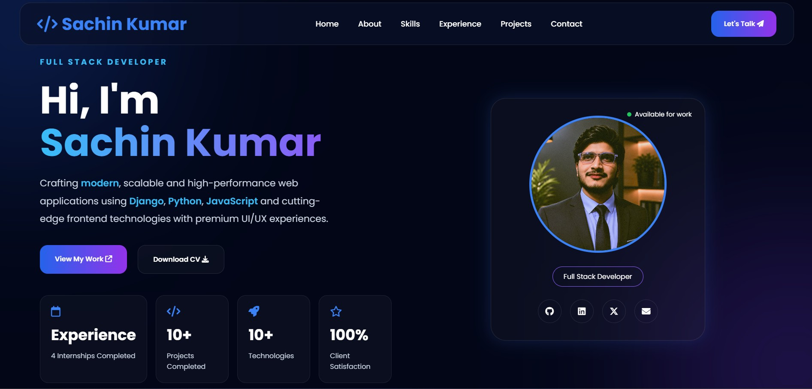
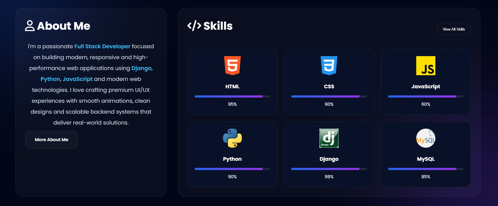
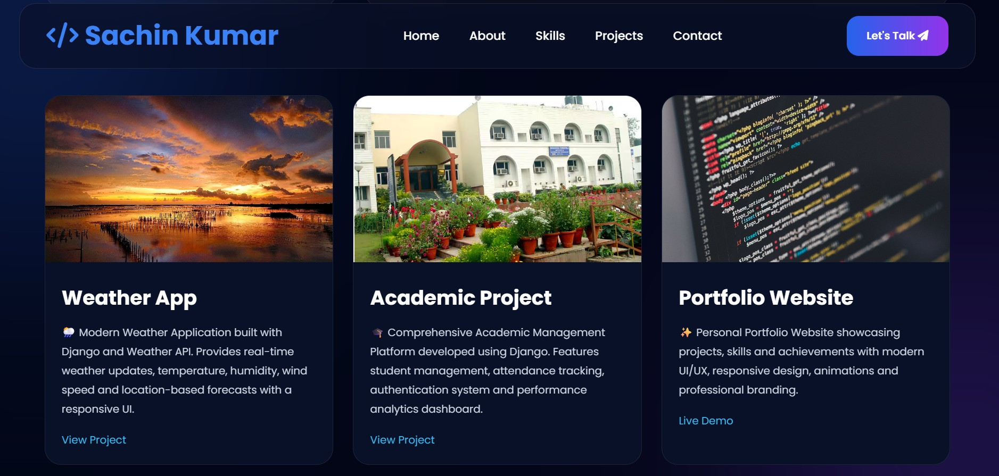
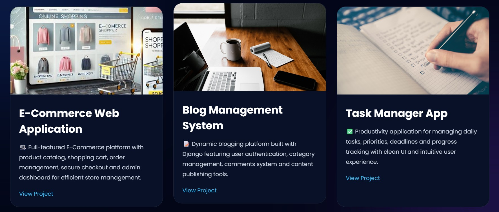
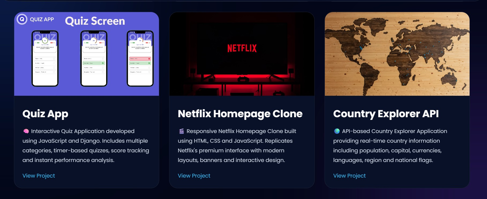
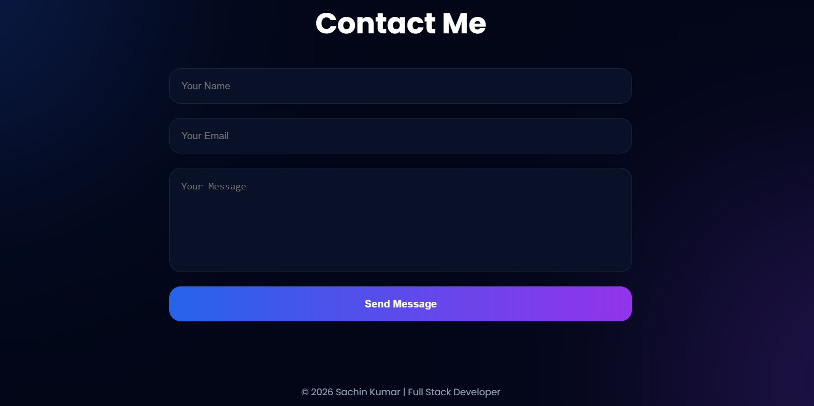
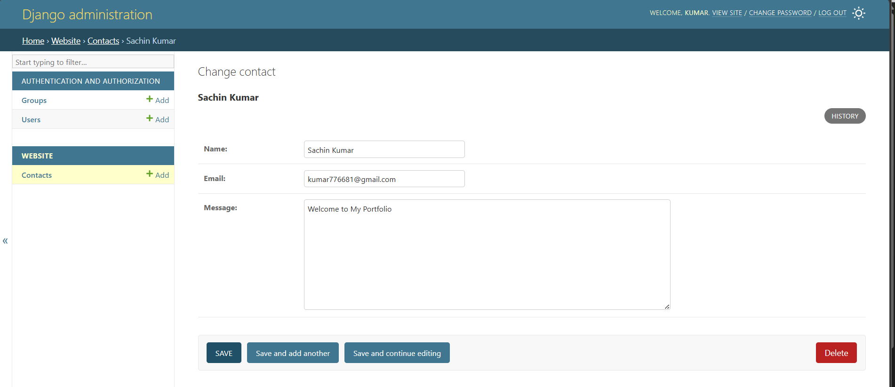

# 🌐 Personal Portfolio Website

This is my Personal Portfolio Website built using HTML, CSS, JavaScript, and Django (if applicable). It showcases my skills, projects, and contact information in a clean and responsive design.

---

## 🚀 Live Demo
👉 [Click here to view live project](#)  
(https://personal-portfolio-ywxz.onrender.com/)

---

## 📌 Features

- Responsive and modern UI design
- About Me section
- Skills showcase
- Projects gallery
- Contact form
- Social media links integration

---

## 🛠️ Technologies Used

- HTML
- CSS
- JavaScript
- Python
- Mysql
- Django (if backend used)
- Git & GitHub

---
  ## Screenshot

## 👨‍💻 Author

Sachin Kumar

### LinkedIn
[LinkedIn Profile](https://www.linkedin.com/in/sachin-kumar-362b53343/)

### GitHub
[GitHub](https://github.com/SACHIN197-creator)

---

